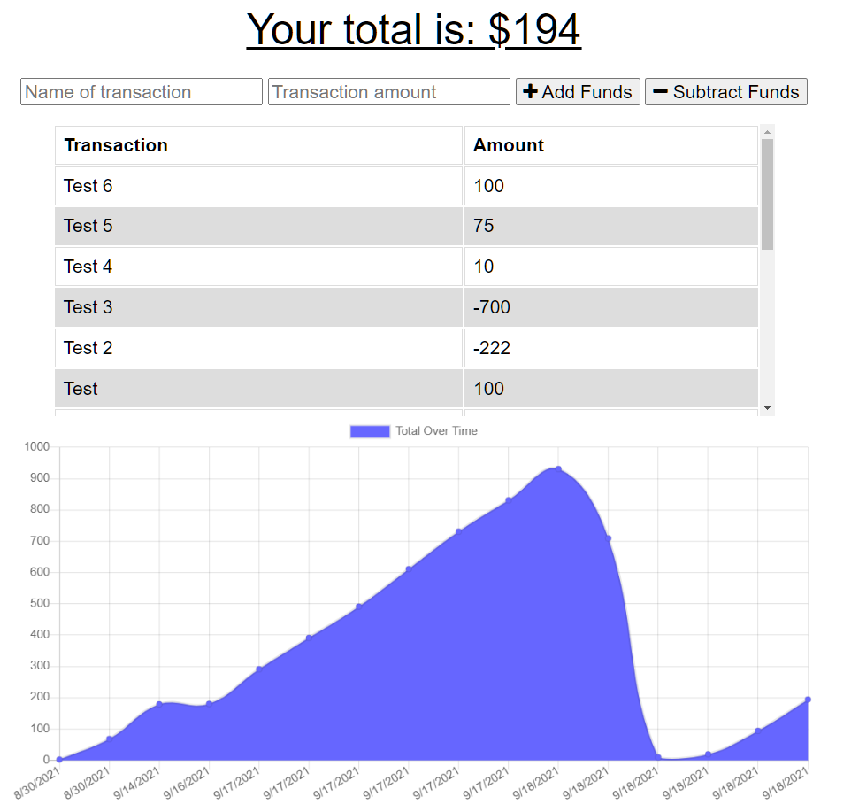

# Budget Tracker PWA

## Description

An online/offline PWA that allows users to track their finances.
  
--- 

## https://github.com/lancebailey26/budgetTrackerPWA
## https://morning-depths-45926.herokuapp.com/

--- 

## Installation

Install necessary packages with `npm i` in your termnial, then run the start script.

--- 

## Usage

Use the UI to add and subtract funds from your account.

## Credits

n/a

## Copyright Lance Bailey 09/18/2021 License: MIT License